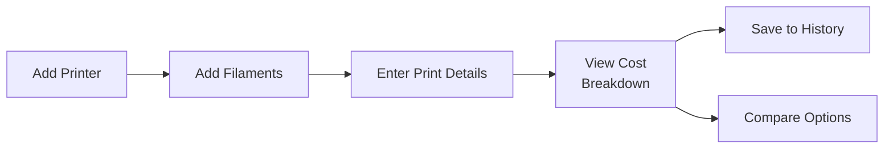

# 3DPrintCostCalculator (3DPCC)

**FDM 3D Print Cost Calculator**

A web-based tool for calculating the true cost of FDM 3D prints, including filament, electricity, printer depreciation, consumable wear, and more.


---

## Features

- **Accurate Cost Calculation** — Accounts for all cost factors: filament, electricity, depreciation, consumables, labor, failure rate, and markup
- **Profit/Loss Calculator** — Enter a selling price to see your profit or loss instantly
- **Multi-Filament Support** — Calculate costs for multi-color prints with different filament types
- **AMS Support** — Track Bambu Lab AMS power consumption and depreciation
- **Printer Presets** — Quick setup with presets for Bambu Lab, Prusa, Creality, Anycubic, and Voron printers
- **Multiple Profiles** — Manage multiple printers and filament types
- **Consumable Tracking** — Track wear on nozzles, beds, belts, and other parts with replacement alerts
- **Location-Based Rates** — Pre-configured electricity rates for 50+ regions worldwide
- **Cost Comparison** — Compare costs across different printer/filament combinations
- **Print History** — Save and track all your print calculations
- **Dashboard Analytics** — Visualize spending trends and cost breakdowns
- **Privacy First** — All data stored locally in your browser, nothing sent to servers
- **Dark Mode & Themes** — Light, Dark, and festive Christmas themes
- **Accessible** — WCAG 2.1 Level AA compliant for keyboard and screen reader users
- **No Installation** — Pure HTML/CSS/JS, runs in any modern browser

## Quick Start

1. Download or clone this repository
2. Open `index.html` in your browser
3. Select your location (for electricity rates)
4. Add your printer(s) and filament(s)
5. Start calculating!

## Changelog

### v1.3.0
- Profit/loss calculator with selling price field
- Tooltips on all calculator fields for guidance
- Improved UI with text labels for header buttons

### v1.2.0
- Dark mode and Christmas theme with theme toggle
- Theme preference saved to localStorage

### v1.1.0
- Multi-filament support for multi-color prints
- AMS support (power consumption and depreciation tracking)
- Removed G-code parsing (enter values manually from your slicer)

### v1.0.0
- Initial release
- Cost calculator with filament, electricity, depreciation, consumables, labor, failure rate, and markup
- Printer presets for Bambu Lab, Prusa, Creality, Anycubic, Voron
- Printer and filament profile management
- Consumable tracking with wear indicators
- Location-based electricity rates (50+ regions)
- Print history and cost comparison tools
- Dashboard with charts and analytics
- Import/export data as JSON
- WCAG 2.1 Level AA accessibility

**Try it online:** [https://3dprintcost.pages.dev](https://3dprintcost.pages.dev)

## Getting Started Walkthrough

This example walks through setting up a printer, adding two filaments, and calculating your first print cost.

### Step 1: Add Your Printer

1. Go to **Printers** → Click **Add Printer**
2. Select a preset (e.g., "Bambu Lab P1S") or enter details manually:
   - Name: `My P1S`
   - Purchase Price: `$699`
   - Expected Lifetime: `5000 hours`
3. If you have an AMS, check "This printer has an AMS attached" and select your model
4. Click **Add Printer**

### Step 2: Add Your Filaments

**Filament 1: Standard PLA**
1. Go to **Filaments** → Click **Add Filament**
2. Enter:
   - Name: `Bambu PLA Basic - Black`
   - Material: `PLA`
   - Spool Weight: `1000g`
   - Spool Price: `$18`
3. Click **Add Filament**

**Filament 2: Premium PETG**
1. Click **Add Filament** again
2. Enter:
   - Name: `Prusament PETG - Galaxy Black`
   - Material: `PETG`
   - Spool Weight: `1000g`
   - Spool Price: `$30`
3. Click **Add Filament**

### Step 3: Calculate a Print

1. Go to **Calculator**
2. Enter print details from your slicer:
   - Print Time: `150 minutes` (2h 30m)
   - Add each filament used and its weight in grams
3. Select your printer
4. Click "Add Filament" for multi-color prints to add more filaments
5. Adjust settings if needed (failure rate, markup for selling)
6. View the cost breakdown

### Example Result

For a 2.5 hour print using 45g of PLA ($18/kg):

| Cost Component | Amount |
|----------------|--------|
| Filament | $0.81 |
| Electricity | $0.05 |
| Depreciation | $0.35 |
| **Subtotal** | **$1.21** |
| Failure Buffer (5%) | $0.06 |
| **Total** | **$1.27** |

### Understanding the Flow



## Cost Calculation

3DPCC uses a comprehensive formula to calculate the true cost of a print:

```
Filament Cost    = grams used × (spool price ÷ spool weight)
Electricity Cost = (printer watts ÷ 1000) × hours × rate per kWh
Depreciation     = (purchase price ÷ lifetime hours) × print hours
Consumables      = Σ (item price ÷ item lifetime hours) × print hours
Labor Cost       = labor hours × hourly rate

Subtotal         = Filament + Electricity + Depreciation + Consumables + Labor
Failure Buffer   = Subtotal × (failure rate ÷ (1 - failure rate))
Markup           = (Subtotal + Failure Buffer) × markup percentage

TOTAL            = Subtotal + Failure Buffer + Markup
```

### Why Include Failure Rate?

A 5% failure rate means 1 in 20 prints fails. The failure buffer accounts for wasted material and time from failed prints, giving you a more realistic cost per successful print.

## Electricity Rates

Pre-configured rates for 50+ regions including:

- **North America** — USA (by state), Canada
- **Europe** — UK, Germany, France, Netherlands, Spain, Italy, and more
- **Asia-Pacific** — Australia, New Zealand, Japan, South Korea, China, India
- **South America** — Brazil, Argentina

You can also enter a custom rate for your specific utility provider.

## Data Storage

All data is stored in your browser's localStorage:
- Printer profiles
- Filament library
- Consumables
- Print history
- Settings

**Export/Import:** Use the Export button to backup your data as JSON. Import on another device or browser to restore.

**Privacy:** No data is ever sent to any server. Everything stays on your device.

## Tech Stack

- Vanilla HTML/CSS/JavaScript (no framework, no build step)
- [Chart.js](https://www.chartjs.org/) for visualizations
- localStorage for data persistence

## Browser Support

Works in all modern browsers:
- Chrome/Edge 80+
- Firefox 75+
- Safari 13+

## Contributing

Contributions are welcome! Feel free to:
- Report bugs via [GitHub Issues](https://github.com/8bits1beard-io/PrintCost/issues)
- Submit feature requests
- Open pull requests

## License

MIT License — see [LICENSE](LICENSE) for details.

Created by [Joshua Walderbach](https://github.com/8bits1beard-io)

---

**3DPrintCostCalculator** — Know your true printing costs.

---

*Dedicated to all my ex-girlfriends. If only there was a calculator for relationships — I could have seen the total cost, failure rate, and expected wear on my consumables!*
